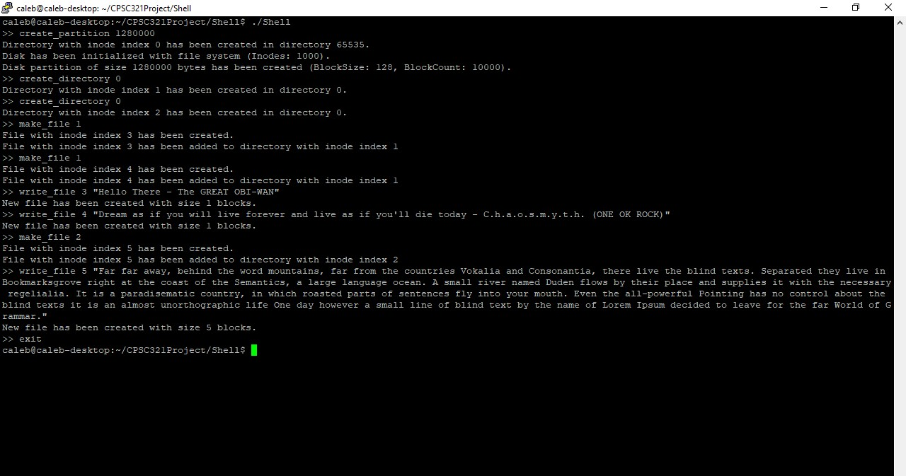

When first openening the shell, you are greated by '>>" characters. When this happens,
the shell is waiting to recieve input. The commands of the shell are listed below with general arguements:

1) disk_write [Disk location (integer)] [String <= 128 characters]
    - Write a block to disk.
    - Disk location is in blocks rather than bytes (InodeBitmapBlock would be at disk location 1 rather than 128 (if thinking in bytes))
    - Method can accept more than strings larger than 128 characters, but will give error message to user
    saying thats not intended use of the method.

2) disk_read [Disk location (integer)]
    - Read a block from disk.
    - Disk location is in blocks rather than bytes (InodeBitmapBlock would be at disk location 1 rather than 128 (if thinking in bytes))

3) create_partition [Number of bytes (integer)]
    - Create a virtual disk with the size of bytes for the arguement.

4) create_directory [Directory index (integer)]
    - Takes an inode index of a directory and creates a directory in it.

5) make_file [Directory index (integer)]
    -Creates a file and prints inode index that it took so it can be used for other commands.
    -Makes

6) write_file [Inode index (integer)] [String]
    -
    - String can be any size and creates blocks corresponding

7) delete_file [Inode index (integer)]
    - Delallocates all pointer blocks.
    -

8) exit

9) Many of the other commands in linux, as there is a general execute function as well.

Note: When entering strings into shell, surroud the whole string with " on both sides as
this will tell the shell to take the whole string as a single arguement. Check the 'Known Bugs'
section below just for a note on the shell.

Note: Since calloc is used for disk, the whole disk is initializd to zero. This means essentialy
that I only need to adjust values in superblock for formatting the disk. 

__________________________________________________________________________________________________

How to go about doing the commands:

1) Create a partition using create_partition command.
    This will create a emulated disk of specified bytesize which will be divided into blocks
    which may result in a bit of unused space at the end of a disk if it is not "clean" division.
    This will also format the disk with a file system, granting that the block count is greater than
    or equal to 4.
    
    Note: If the disk is not initially created, then other file system / disk commands will return an
    error message requiring the user to use create_partition command before doing anything.

2) Do whatever you want to do for testing.
    Note: When creating files or directories, an inode value will be returned to the user saying which
    inode index has been selected as to represent the file. This inode value will then be used for other
    commands when wanting to do something with the file.
    

3) When you want to quit, type 'exit' into the shell.

__________________________________________________________________________________________________

Assumptions:
 - String names for files and directories are nice, but not necessary for the assignment
   as functionallity can still be checked with inode indecies.
 - I did not implement a readFile method as it was not specified to do so in the project description.
   There are some commmented out prints in Disk.c (Line 38) in writeDisk that can be uncommented to see all the writes,
   but it did not seem necessary as it fills up console with lots of different writes that such as bitmap writes, etc.
 - I did not implement a recursive delete for directories as that was not specified in the project description.
   Note that will still delete the a directory, but the files could not be in a directory technically.
 - I assumed that once a file is written to it is never written to again since functionallity can be achieved by
    deleting a file the makeing and writing to a new one.

__________________________________________________________________________________________________

Known Bugs:

When entering strings with no spaces into a command such as the 'disk_write "Hello"',
the shell will return an message saying there needs to be a closing ". When inputting strings
with no spaces, remove "" marks surrounding the string.
__________________________________________________________________________________________________

This is the example for part 3

___________________________________________________________________________________________________

How to compile:

gcc -o Shell Shell.c Shell.h Disk.h Disk.c